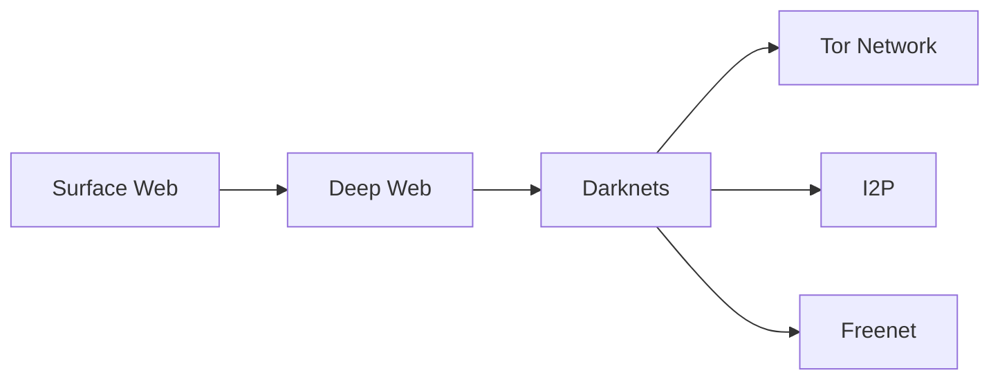

# DarkMatter Darknet: Understanding the Dual Nature of the Dark Web


## DarkMatter Darknet

**Get the DarkMatter Darknet URL here: [https://dark-matter-market.org](https://dark-matter-market.org)** (Educational access only). The **DarkMatter Darknet** project is an educational resource exploring the complex ecosystem of darknet networks, with particular focus on legitimate research applications. While often associated with illicit activities, darknets like Tor provide critical infrastructure for privacy-focused users.

- Privacy-conscious researchers
- Whistleblowers and journalists
- Cybersecurity professionals
- Political dissidents in oppressive regimes

**Website Reference:** [DarkMatter Research Portal](https://dark-matter-market.org) (Educational purposes only)

## Understanding the Technology Stack

### Core Components of Darknets



1. **Encryption Layers**: Multiple encryption points protect user data
2. **Onion Routing**: Traffic passes through several relay points
3. **Decentralization**: No single point of control or failure

## Legitimate Use Cases of DarkMatter Networks

### Academic Research Applications
- Anonymized data collection for social studies
- Censorship-resistant publishing platforms
- Cybersecurity threat intelligence gathering

### Whistleblower Protections
- Secure document submission systems
- Anonymous tip lines for journalists
- Human rights reporting from conflict zones

## Safety and Ethics Considerations

### Recommended Practices
- Always use updated security software
- Never reveal personal information
- Verify all .onion addresses through multiple sources
- Understand local laws regarding encryption tools

### Ethical Research Framework
1. Obtain proper authorization
2. Maintain detailed research logs
3. Avoid interaction with illicit content
4. Report accidental exposure to authorities

## Project Structure

```
DarkMatter-Darknet/
├── research/               # Academic papers and findings
├── legal/                  # Compliance documentation
├── tools/                  # Security tool configurations (legal use only)
├── resources/              # Educational materials
└── docs/                   # Project documentation
```

## Contributing to DarkMatter Research

We welcome contributions that further understanding of darknet technologies:
- Documentation improvements
- Translation of educational materials
- Peer-reviewed research papers

**Note:** All contributors must adhere to ethical guidelines and applicable laws.

## Frequently Asked Questions

### Is accessing the dark web illegal?
Accessing the dark web is not inherently illegal, but many jurisdictions regulate certain tools and activities. Always consult local laws.

### How do researchers protect themselves?
- Virtual machines
- VPN tunnels
- Disposable environments
- Strict operational security protocols

## Legal Disclaimer

This project does not endorse or facilitate any illegal activities. All research is conducted within ethical boundaries and legal frameworks. The DarkMatter Darknet repository is for educational purposes only.

---

© 2023 DarkMatter Darknet | [Privacy Policy](https://dark-matter-market.org/privacy-policy) | [Terms of Use](https://dark-matter-market.org/terms-of-service)
